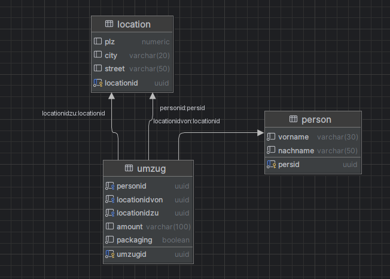

# WalkingSkeleton
Im Rahmen dieser Übung soll eine Anwendung auf Basis eines Walking Skeletons implementiert werden.

Docker Database: 

docker run --name bswes4jungwirthtestdb -p 8001:5432 -e POSTGRES_PASSWORD=secret -d postgres:latest

Database Layout: 

